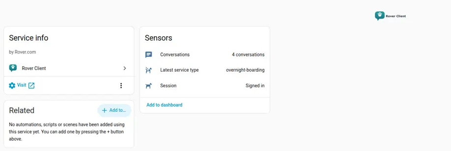
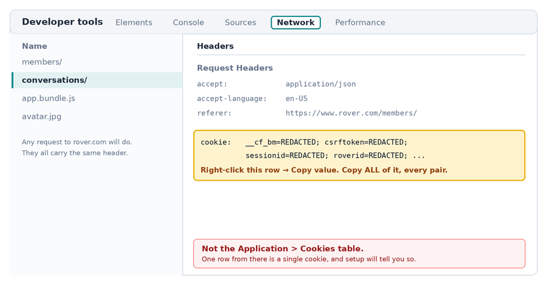
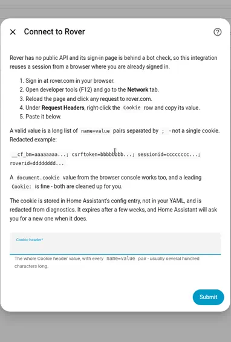
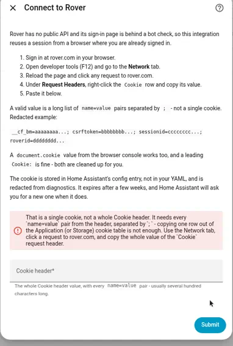
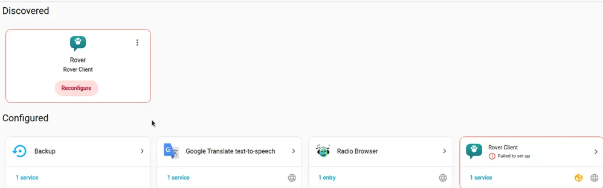
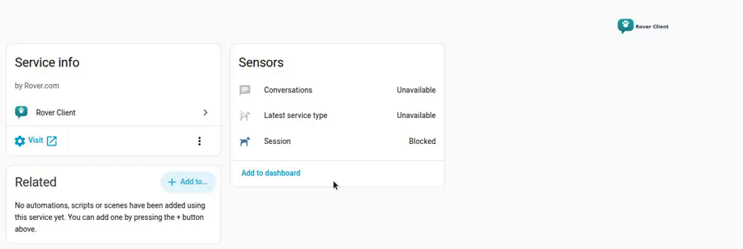
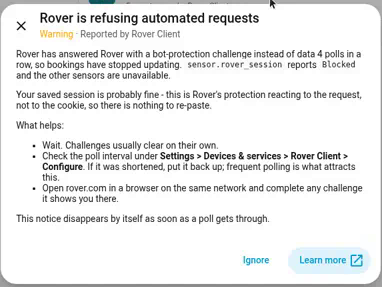
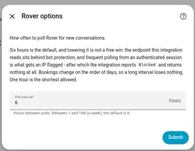

# Rover Client for Home Assistant

[![HACS: custom repository][hacs-badge]][hacs]
[![Validate][validate-badge]][validate]
[![Release][release-badge]][releases]
[![Licence: MIT][licence-badge]][licence]

A Home Assistant integration that reads your [Rover](https://www.rover.com) account — which sitter you booked and what kind of service it is — so automations can react to dog-care bookings.

> **Status: 0.3.0, early but tested.** The core read path works and is in daily use. Read [Limitations](#limitations) before installing — several of them are properties of Rover, not bugs that can be fixed here.



## What it gives you

| Entity | Example | What it's for |
|---|---|---|
| `sensor.rover_session` | `Signed in` | Whether the saved session still works. The one sensor that stays readable when the others don't. |
| `sensor.rover_latest_service_type` | `overnight-boarding` | The service type of the newest booking. Its attributes carry a sitter → service-type map. |
| `sensor.rover_conversations` | `14` | How many conversations the account has. A cheap liveness signal. |
| `binary_sensor.rover_house_access_needed` | `Off` | Whether the newest booking is one that happens at *your* home — a walk, a drop-in or house-sitting — rather than at the sitter's. |

`sensor.rover_session` is the one to write alerts against, because it keeps reporting when the others cannot:

| State | Meaning |
|---|---|
| `signed_in` | The last poll worked. |
| `not_signed_in` | Rover rejected the saved cookie — paste a fresh one via the Reconfigure prompt. |
| `blocked` | Rover answered with a bot-protection challenge. Your cookie is probably fine. |
| `error` | Rover could not be reached at all. |

The per-sitter map on `sensor.rover_latest_service_type` is the useful part when you book several sitters at once:

```yaml
# The attribute key is the sitter's Rover first name, so ask about one by name:
{{ state_attr('sensor.rover_latest_service_type', 'Testsitter') }}   # overnight-boarding

# Or list everyone and what they were booked for:
{{ states.sensor.rover_latest_service_type.attributes }}
```

### An automation that does something real

Announce it when the newest booking is an overnight stay — the case where the dog is away and somebody always asks:

```yaml
automation:
  - alias: Announce a new overnight boarding
    triggers:
      - trigger: state
        entity_id: sensor.rover_latest_service_type
        to: overnight-boarding
    conditions:
      # The sensor also goes to this value on a restart while the same booking is
      # still the newest one, so ignore the transitions that are not news.
      - condition: template
        value_template: >
          {{ trigger.from_state.state not in ['unknown', 'unavailable', 'overnight-boarding'] }}
    actions:
      - action: tts.speak
        target:
          entity_id: tts.piper
        data:
          media_player_entity_id: media_player.kitchen
          message: >
            Overnight boarding is booked with
            {{ state_attr('sensor.rover_latest_service_type', 'latest_sitter') or 'a sitter' }}.
```

And one for the failure case, because a session that quietly expires is the thing most likely to catch you out:

```yaml
automation:
  - alias: Tell me when Rover stops working
    triggers:
      - trigger: state
        entity_id: sensor.rover_session
        to: [not_signed_in, blocked, error]
        for: "01:00:00"
    actions:
      - action: notify.persistent_notification
        data:
          title: Rover needs attention
          message: "Rover session is {{ states('sensor.rover_session') }}."
```

## Sending a sitter the door code

If you have a keypad lock — August, Yale, anything Home Assistant can read a code from or that you keep in a helper — the integration can write the reminder for you and an included blueprint can schedule it:

```
Hi Testsitter - quick one before your walk at 3pm today. The door code is 135790,
on the keypad by the front door. If it gives you any trouble just message me here.
Thank you!
```

That is `rover_client.compose_access_message`. It returns the text and **sends nothing**, and there are two limits behind that design worth knowing before you set it up:

- **Nothing here can post into the Rover chat.** Reading conversations is the one Rover endpoint outside the bot challenge; writing is not. So the reminder goes wherever you send it — to your own phone to paste into the Rover app, which is the default we suggest because it keeps the sitter's phone number out of Home Assistant, or by SMS if you'd rather.
- **The timing has to come from you.** Rover does not publish booking times anywhere this integration can reach, so "an hour before they arrive" needs a calendar you keep. The blueprint triggers off a calendar entity; you add each visit as you confirm it, taking the time from Rover's confirmation email.

`binary_sensor.rover_house_access_needed` is the guard. A boarding stay happens at the sitter's house, so no code goes out for one; walks, drop-ins and house-sitting turn it on. An unrecognised service type reads as off — [failing closed](docs/access-code-reminders.md#why-an-unknown-service-sends-nothing) is deliberate, because the cost of a missed reminder is a phone call and the cost of a wrong one is a house code in a stranger's inbox.

The blueprint has the on/off switch and the timing: it is an ordinary automation, so you can disable it in one click, and the lead time is a dropdown from 15 minutes to a day ahead.

**[Full walkthrough: docs/access-code-reminders.md](docs/access-code-reminders.md)** — the calendar, the code helper, importing the blueprint, and doing it by hand instead.

## Installation

### HACS (custom repository)

1. HACS → ⋮ → **Custom repositories**
2. Add `https://github.com/KennebecRiver66/HARoverClient`, category **Integration**
3. Install **Rover Client**, then restart Home Assistant
4. **Settings → Devices & services → Add integration → Rover Client**

### Manual

Copy `custom_components/rover_client` into your `config/custom_components/` directory and restart.

## Setting it up

Rover has no public API, and its sign-in endpoints sit behind a bot challenge — a scripted username/password login cannot complete it. So this integration reuses a session from a browser where you're already signed in. This is the fiddly step; it is worth doing slowly once.

1. Sign in at rover.com in your browser.
2. Open developer tools (<kbd>F12</kbd>) → **Network**.
3. Reload the page, then click any request to `rover.com`.
4. Under **Request Headers**, right-click the `Cookie` row and copy its **value**.
5. Paste it into the integration's setup form.



*A diagram, not a screenshot — a real capture would contain a real session cookie, which is a full-access credential for the account.*

A valid value is a long list of `name=value` pairs separated by `; `, looking something like this (every value here is redacted):

```
__cf_bm=aaaaaaaa...; csrftoken=bbbbbbbb...; sessionid=cccccccc...; roverid=dddddddd...
```

Two shortcuts also work, because the form cleans them up for you:

- a `document.cookie` value copied out of the browser console, quotes and all;
- the header with its name still attached (`Cookie: __cf_bm=...`), or with the line breaks devtools adds when it wraps a long header.



### If it doesn't take the cookie

The form distinguishes the two mistakes that look identical from the outside:

| What you see | What it means |
|---|---|
| *That is a single cookie, not a whole Cookie header* | You copied one row out of the **Application → Cookies** table. Go back to the Network tab and copy the whole `Cookie` request header. Checked locally, so this one never even reaches Rover. |
| *Rover accepted the request but reported no signed-in session* | The header is well formed, but the browser it came from has signed out since. Sign in again and copy a fresh one. |
| *Rover answered with a bot-protection challenge* | Nothing is wrong with your cookie. Wait a few minutes and try again. |



## When the session expires

**It will**, every few weeks — this is normal operation, not a fault. Home Assistant raises a **Reconfigure** prompt asking for a fresh `Cookie:` header, and a matching repair on the Repairs page:



Pasting a new cookie updates the existing entry, so your entity IDs, history and automations all survive. Nothing has to be deleted and re-added.

## Bot challenges

When Rover answers with a challenge instead of data, `sensor.rover_session` reports `Blocked` and the other two sensors go unavailable — a stale service type presented as current would be worse than no value. The session sensor keeps reporting, because it is the one that tells you *why* the others went quiet.



One challenge is routine and clears itself. Four polls in a row — a day at the default interval — raises a repair, because nothing else would tell you that data has stopped:



## Options

**Settings → Devices & services → Rover Client → Configure** sets the poll interval. Six hours is the default and one hour is the floor.



The floor is not squeamishness. The endpoint sits behind bot protection, and frequent polling from an authenticated session is what earns a block — after which this integration returns nothing at all, which is a much worse outcome than data that is a few hours old. Bookings change on the order of days.

## Limitations

These are the honest edges. Most are Rover's, not this integration's.

**Booking times are not available.** This is the big one. `/api/v3/conversations/` returns the sitter and the service type but no dates or times. `stay_meta` holds only locations and an `itinerary_url`, and that URL returns an HTML document rather than JSON. The endpoints that *would* have times — `/api/v3/stays/<id>/` and `/account/stays/<id>/` — are behind the bot challenge and unreachable with a session cookie. If you need drop-off and pick-up times, they have to come from the Rover confirmation **email**, not from here. Anything time-based, including the [door-code reminder](#sending-a-sitter-the-door-code), therefore triggers off a calendar you maintain rather than off Rover.

**Cookie auth, with all that implies.** No OAuth, no API key, no refresh. The session expires and you re-paste. A cookie is a full-access credential for your Rover account, so treat Home Assistant backups as secrets.

**One Rover account per Home Assistant.** The config entry's unique ID is the integration domain, so a second account aborts with *already configured*. Lifting this needs a stable per-account identifier, and the one endpoint reachable with a cookie does not carry one — the cookie itself rotates, so it cannot be the identity. If you need two accounts, two Home Assistant instances is the only answer today.

**Polling is deliberately slow.** Six hours by default, one hour minimum. See [Options](#options) for why.

**Bot challenges happen.** See [above](#bot-challenges).

**Read-only.** It cannot book, message, or cancel anything. This is by design rather than by omission: Rover's write endpoints sit behind the same bot protection, so anything that changed state would be both unreliable and a much bigger thing to trust a custom integration with. If it ever grows writes, they will be a separately gated concern. It is also why `compose_access_message` hands the reminder back instead of sending it.

**English only.** `strings.json` is the source of the UI text and `translations/en.json` is generated from it by [`scripts/sync_translations.py`](scripts/sync_translations.py), which CI checks. Translations into other languages are welcome; drop a `translations/<code>.json` alongside it.

## Roadmap

- **Sitter availability** from sitters' public Rover calendars — no auth, and not behind the bot challenge, so it is a genuinely more reliable data source than the one used here. It can answer "who is free on the 7th?". Designed but not implemented; see [docs/sitter-availability.md](docs/sitter-availability.md) for the design and for what has to be verified first.
- **Booking times from the confirmation email**, which would let the door-code reminder schedule itself instead of reading a calendar you keep by hand. Needs an IMAP-based parser and one redacted sample email to build it against.
- A `binary_sensor` for "a booking is active right now" (needs times, so it needs the email route).
- `strict-typing` clean bill of health.

## Development

```bash
python3 -m venv .venv && . .venv/bin/activate
pip install -r requirements_test.txt
python -m pytest                       # 147 tests, real Home Assistant fixtures
ruff check .
python3 scripts/sync_translations.py   # after editing strings.json
```

See [CONTRIBUTING.md](CONTRIBUTING.md). Never put a real `Cookie:` value, a real sitter name or unredacted diagnostics in an issue, a test or a fixture.

## Privacy

The cookie is stored in Home Assistant's config entry, not in your YAML, and is redacted from diagnostics. Diagnostics report how many sitters were seen and which service types appeared, never who they are — deliberately, so a diagnostics dump is safe to paste into a public issue.

A door code passed to `compose_access_message` is not stored anywhere by this integration and is never logged, but anything passed to any service call appears in that automation's **trace**, which is kept in your config directory and shown in the UI. That is local to your instance, and it is a reason to rotate the code rather than to avoid the feature.

## Licence

MIT — see [LICENSE](LICENSE).

*Not affiliated with, endorsed by, or supported by Rover.com. It reads your own account on your behalf using your own session, and can break at any time if Rover changes its site.*

[hacs]: https://github.com/hacs/integration
[hacs-badge]: https://img.shields.io/badge/HACS-custom%20repository-41BDF5.svg
[validate]: https://github.com/KennebecRiver66/HARoverClient/actions/workflows/validate.yml
[validate-badge]: https://github.com/KennebecRiver66/HARoverClient/actions/workflows/validate.yml/badge.svg
[releases]: https://github.com/KennebecRiver66/HARoverClient/releases
[release-badge]: https://img.shields.io/github/v/release/KennebecRiver66/HARoverClient?display_name=tag&sort=semver
[licence]: LICENSE
[licence-badge]: https://img.shields.io/badge/licence-MIT-green.svg
